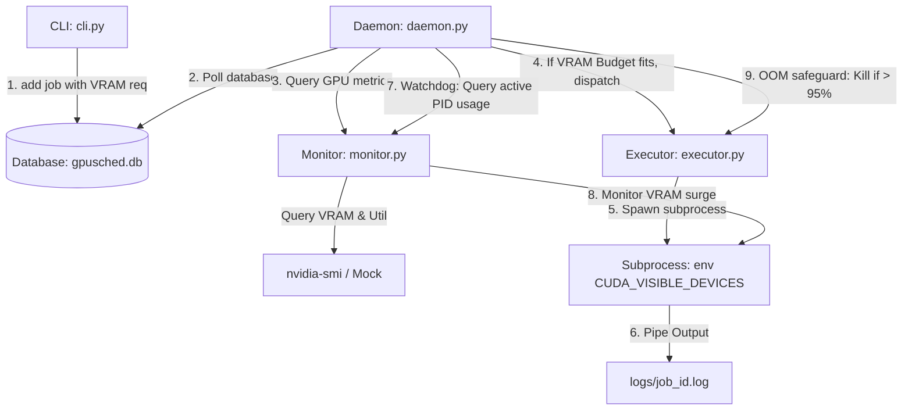

# GPU Job Scheduler

A lightweight, single-user resource-aware GPU task scheduler operating entirely within user-space without administrative (`sudo`) privileges. It coordinates queue telemetry via a SQLite file database and dispatches CUDA workloads sequentially based on real-time hardware telemetry.

---

## 1. Scientific Domain Expertise & Operational Physics

The scheduler governs resource allocations on specialized compute nodes. The system state is evaluated at time interval $t$ using local telemetry.

### A. Resource Availability Evaluation
For each GPU device index $g$, the scheduler core computes a resource availability flag $A_g(t) \in \{0, 1\}$:

$$A\_g(t) = \mathbb{I}\left( \frac{M\_{\text{used},\, g}(t)}{M\_{\text{total},\, g}(t)} < \theta\_M \right) \cdot \mathbb{I}\left( U\_{\text{gpu},\, g}(t) < \theta\_U \right)$$

where:
- $M\_{\text{used},\, g}(t)$ and $M\_{\text{total},\, g}(t)$ are active and total memory allocations in Megabytes (MB).
- $U\_{\text{gpu},\, g}(t)$ is the core load utilization percentage ($0 \le U\_{\text{gpu},\, g}(t) \le 100$).
- $\theta\_M$ and $\theta\_U$ are normalized thresholds ($0.0 \le \theta\_M, \theta\_U \le 1.0$) set by the environment.
- $\mathbb{I}(x)$ is the indicator function mapping true assertions to $1$ and false assertions to $0$.

---

## 2. Resource-Aware Control Architecture

To prevent system Out-Of-Memory (OOM) crashes, the scheduler couples VRAM capacity checking with active subprocess PID monitoring.



### A. Core Workflow & State Machine
1. **Submit**: A user submits a shell script or command via CLI:
   `python -m gpu_scheduler.cli add "sh train.sh" --req-mem 6000`
   This inserts a record into the SQLite DB with status `PENDING` and tags it with the requested memory limit.
2. **Budget Gating**: The Daemon checks if any GPU $g$ has enough VRAM budget. VRAM budget is calculated as:
   $$M\_{\text{budget},\, g}(t) = M\_{\text{total},\, g} - \sum\_{j \in \mathcal{R}\_g} M\_{\text{req},\, j}$$
   where $\mathcal{R}\_g$ is the set of running/assigned jobs on GPU $g$.
3. **Dispatch**: If the allocated budget check `M_budget >= M_req` is satisfied, the daemon transitions the task state:
   $$\text{status}(j) \leftarrow \text{ASSIGNED}, \quad \text{gpu}(j) \leftarrow g$$
   It then spawns the process under the environment variable `CUDA_VISIBLE_DEVICES` set to $g$.
4. **Watchdog**: During execution, the daemon monitors the active PID memory footprint `M_active(t)` and updates the `peak_mem` database field. If it exceeds $95\%$ of total GPU memory capacity, it terminates the subprocess to avoid system OOM.

---

## 3. Database Schema Specification

The relational schema for the SQLite coordination engine is defined as follows:

| Column | Data Type | Constraints / Description |
| :--- | :--- | :--- |
| **id** | INTEGER | PRIMARY KEY AUTOINCREMENT |
| **command** | TEXT | Shell script or executable command to run |
| **status** | TEXT | CHECK(status IN ('PENDING', 'ASSIGNED', 'RUNNING', 'COMPLETED', 'FAILED')) |
| **username** | TEXT | Submitting OS user identifier |
| **priority** | INTEGER | Job scheduling priority weight (Default: 0) |
| **gpu_assigned** | INTEGER | Allocated GPU device index (NULL if pending) |
| **pid** | INTEGER | Spawned subprocess OS PID |
| **exit_code** | INTEGER | Return exit code of the finished subprocess |
| **req_mem** | INTEGER | User-declared VRAM requirement in MB (Default: 0) |
| **peak_mem** | INTEGER | Peak VRAM consumption captured in MB (Default: 0) |
| **created_at** | TEXT | Creation timestamp (ISO-8601) |
| **started_at** | TEXT | Execution start timestamp (ISO-8601) |
| **ended_at** | TEXT | Execution termination timestamp (ISO-8601) |

---

## 4. Operational Instructions

### A. Environment Variable Configurations
Configure these in your shell profile:
- `GPUSCHED_DIR`: Absolute path to the database/logs folder (Default: `~/.gpusched`).
- `GPUSCHED_POLLING_INTERVAL`: Polling interval in seconds (Default: `5.0`).
- `GPUSCHED_MEM_THRESHOLD`: Normalized memory limit (Default: `0.20`).
- `GPUSCHED_UTIL_THRESHOLD`: Normalized GPU util limit (Default: `0.15`).
- `GPUSCHED_MOCK`: Set to `true` to enable simulated mock telemetry.

### B. Standard CLI Command Harness
```bash
# 1. Initialize DB and directories
python -m gpu_scheduler.cli init

# 2. Start the Scheduler Daemon (runs execution & watchdog)
python -m gpu_scheduler.cli start

# 3. Enqueue a job with custom VRAM reservation (e.g., 6000MB)
python -m gpu_scheduler.cli add "sh train.sh" --req-mem 6000

# 4. Monitor VRAM budgets and peak usage
python -m gpu_scheduler.cli status

# 5. Terminate the background daemon
python -m gpu_scheduler.cli stop
```

---

## 5. Comparative Evaluation against Existing Solutions

Below is a comparison of this lightweight scheduler with standard workload managers.

| Feature | Slurm Workload Manager | Kubernetes GPU Scheduler | `gpu_scheduler` (Our Solution) |
|---|---|---|---|
| **Primary Scope** | Large HPC Cluster Scheduling | Container Orchestration (Cloud) | Small-scale multi-user GPU servers |
| **Administrative Privilege** | Required (`root` / `sudo`) | Required (`root` / `sudo`) | **None** (User-space execution) |
| **Setup Complexity** | High (Complex daemon & gres config) | High (K8s cluster + NVIDIA plugins) | **Low** (Single database file) |
| **Resource Isolation** | Strong (Cgroups hardware limits) | Strong (Container namespaces) | Moderate (Environment boundary matching) |
| **Communication Layer** | RPC / TCP Networks | REST API / Etcd Storage | **SQLite (Shared File Database)** |
